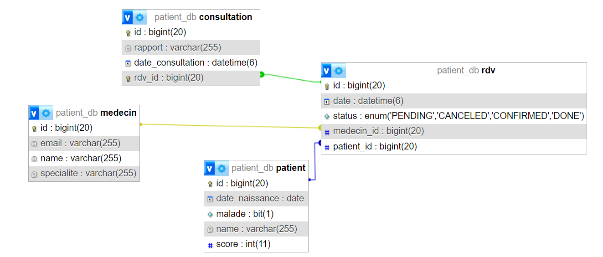

# Gestion des Patients avec Spring Boot et JPA
### Réaliser par : Nouhayla MOUAKKAL
### FI: II-BDCC 2

Ce projet démontre l'implémentation d'une application simple de gestion des patients en utilisant Spring Data JPA pour les opérations de base de données. Il met en lumière la réalisation des opérations CRUD (Créer, Lire, Mettre à jour, Supprimer) sur les entités Patient. Initialement configuré avec une base de données H2 en mémoire, le projet évolue ensuite vers l'utilisation de MySQL.



## Configuration de l'Environnement

Veuillez vous assurer que les éléments suivants sont installés et configurés sur votre machine :

- JDK 17 ou version ultérieure
- Maven 3.2 ou version ultérieure
- Plugin Lombok pour votre IDE
- Serveur MySQL (pour la migration)

## Installation et Exécution

**Clonez le dépôt** :

```bash
git clone https://github.com/NouhaylaMouakkal/ORM-Jpa-Hibernate-Spring-Data.git
```

## Fonctionnalités
- Ajout de patients, de médecins, de rendez-vous et de consultations.
- Consultation de tous les patients : une fois ajoutés, l'application affiche la liste complète des patients stockés en base de données.
- Consultation, recherche, modification et suppression de patients : la méthode run offre également un aperçu de la manière d'effectuer ces opérations.

## Technologies Utilisées
- Spring Boot comme framework de l'application
- Spring Data JPA pour l'interaction avec la base de données
- Lombok pour réduire le code boilerplate
- Base de données H2 comme base de données initiale
- MySQL comme base de données cible pour la migration
